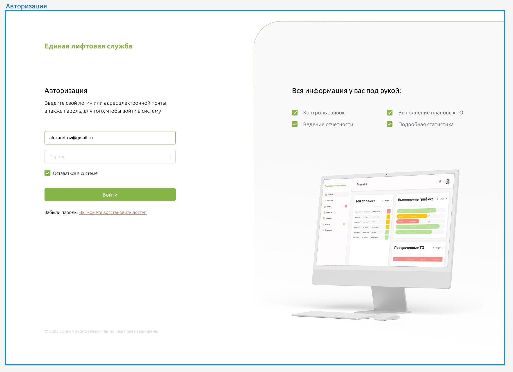
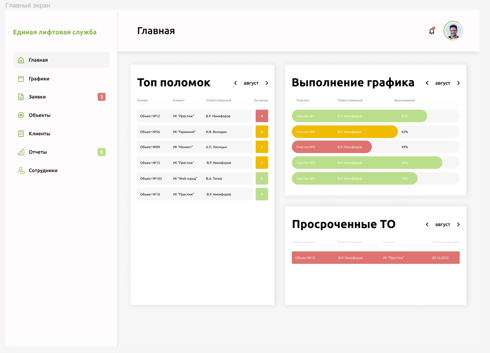
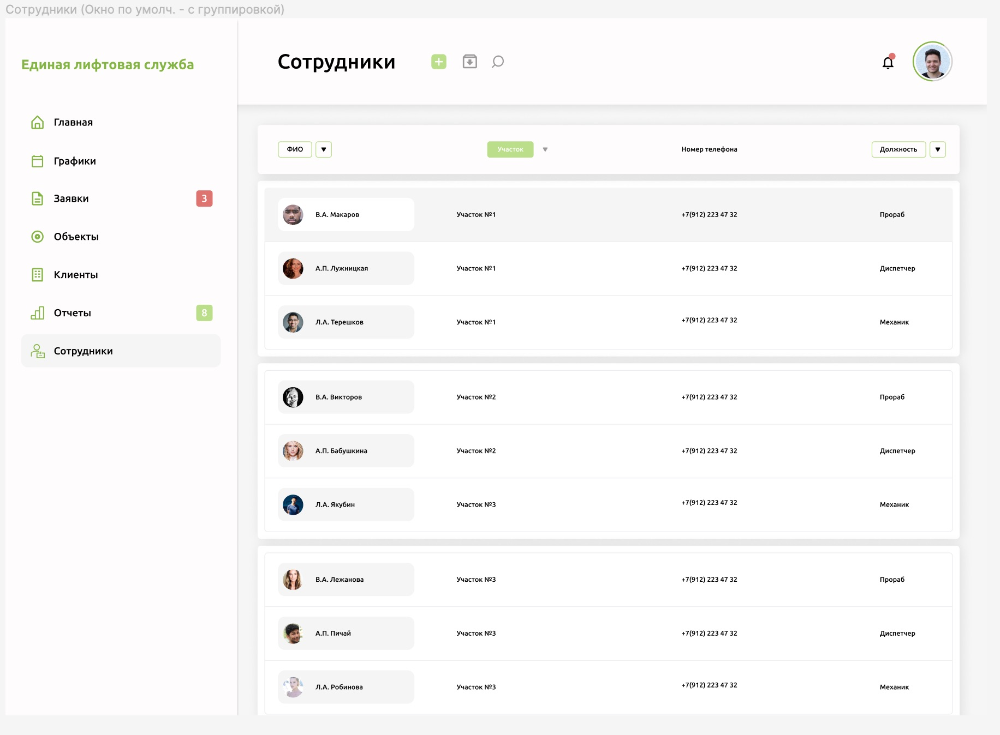
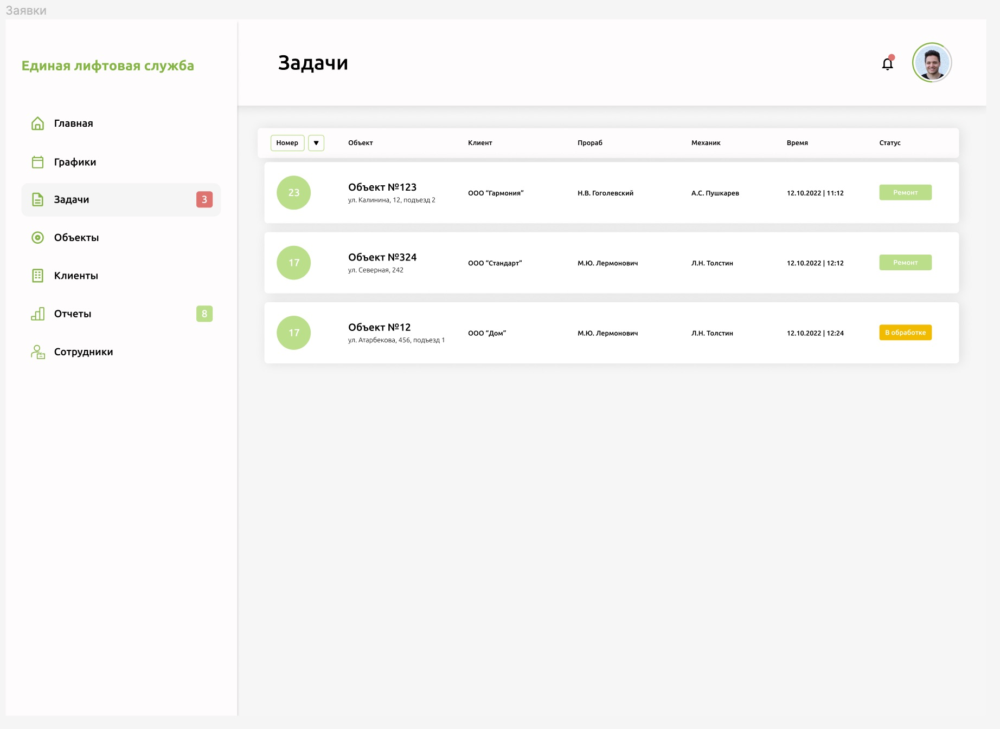

Здравствуйте, я очень рад, что вы смотрите мой проект, постараюсь рассказать о нем вкратце.

Основная суть проекта заключается в помощи:

• Руководителям - избавиться от рутинных операционных вопросов в управлении персоналом. Видеть реальную работоспособность каждого сотрудника.

• Прорабам - имеет возможность управлять большим количеством механиков и объектов и делать это качественнее. (сейчас прораб может обслужить 280 ед. техники, с приложением сможет держать более 500)

• Механикам - получает задание в котором указана вся информация об объекте, так же пошаговая инструкция по выполнению работ, а в важных узлах, необходимо сделать фото.

• Клиентам - видеть актуальную информацию о состоянии своего оборудования, получать отчеты с фото и иметь возможность своевременно реагировать на выявленные дефекты.   

• Диспетчерам - создавать внутри системы заявку и вызывать механика на аварийное реагирование, в случае выхода лифта из строя. 

Так же в приложении предусмотренна статистика, аналитика, система начисления баллов за выполненные работы, которые сотрудник может потратить у партнеров, раздел с информацией о новых положениях для лифтовых компаний, это позволит исключить издержки на инженера охраны труда.  
Авторизация

Главная

Список сотрудников

Пример аккаунта сотрудника

Список объектов

Отображение всех Объектов на карте

Пример одного объекта

Задачи

